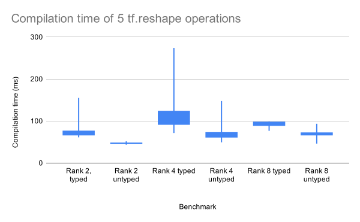
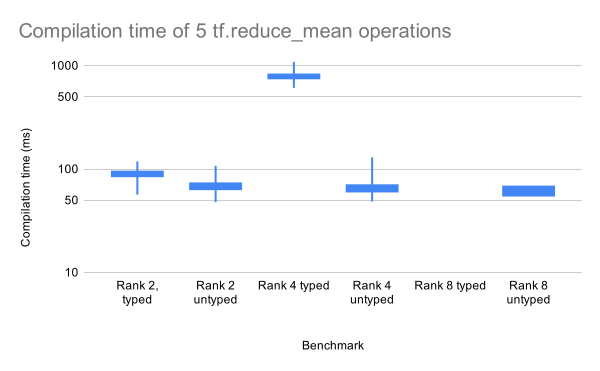

To evaluate the overhead of statically verifying tensor shapes, we have run a set of compilation benchmarks for programs using tf-dotty, comparing compilation times with and without static checks for tensor shapes. The graphs below show 99.9% confidence intervals in the boxes; highs and lows are shown by the bars. All figures below show compilation times for operations on tensors of rank 2, 4 and 8, both with ("typed") and without ("untyped") static shape checks.

## Reshape

As expected, the benchmarks show that compilation time grows with tensor rank, and that statically checking the reshape dimensions results in an overhead. However, this overhead is low, at around 30ms per compilation, regardless of tensor rank. This corresponds to 6ms of overhead per reshape operation on average, which is most likely an acceptable overhead for most machine learning workloads.

## Reduce

Note the logarithmic scale on the y-axis.

As mentioned in the section on [typing reduction operations](reduce.md), the reduction on a shape type is implemented as a \\( \mathcal{O}(m\cdot n) \\) algorithm. The benchmarks keep \\(m = n\\), which would warrant a quadratic growth in compilation time. However, the time to compute the resulting type of a reduction along 8 axes was much higher than expected, as compilation never finished.

Compiling a single reduction along 6 axes compiled in 500-1500ms on average, depending on the order of the indices, while compiling 5 reductions along 6 axes compiled in around 70s on average. This goes against the expectation that, in a program containing only independent function calls to reduction operations, compilation time would grow linearly with the number of reductions.

This is therefore still work in progress.
